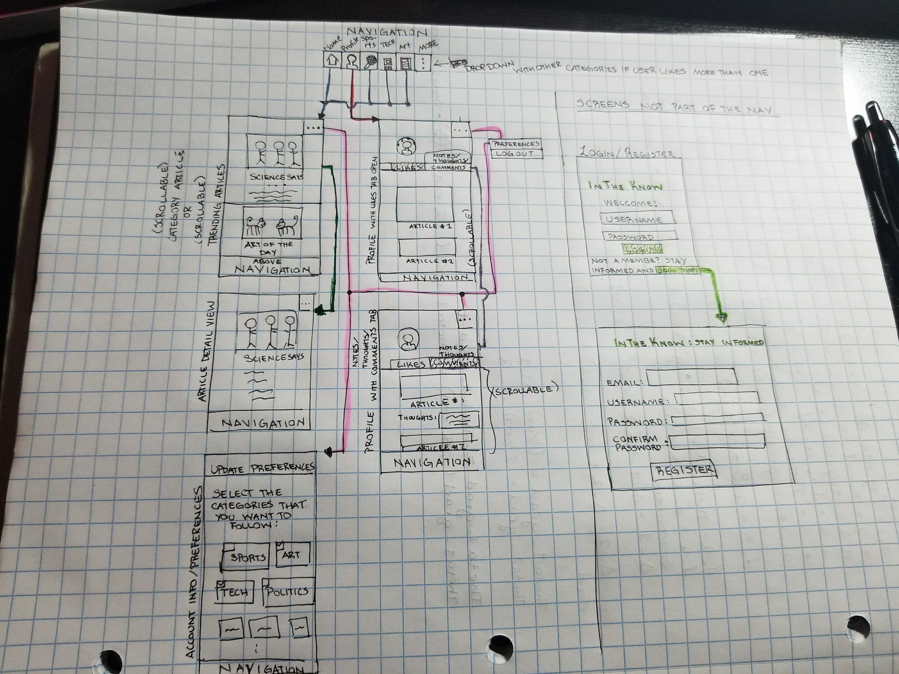
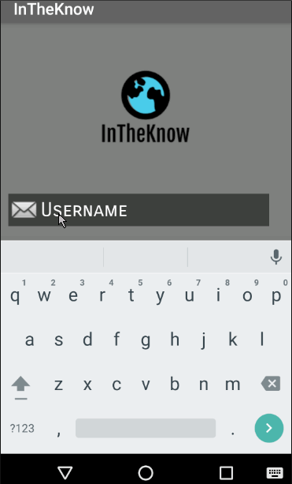
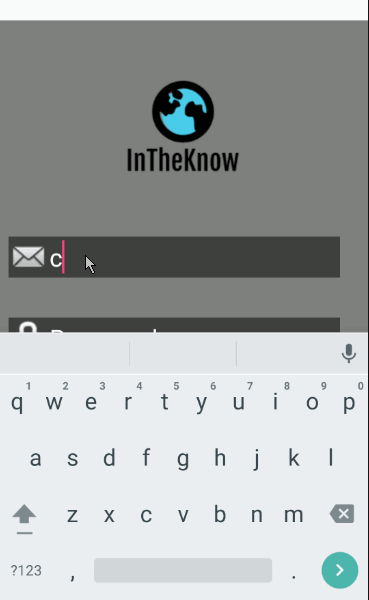

# InTheKnow

## Table of Contents
1. [Overview](#Overview)
1. [Product Spec](#Product-Spec)
1. [Wireframes](#Wireframes)
2. [Schema](#Schema)
2. [Walkthrough One](#Walkthrough-One)

## Overview
### Description
InTheKnow is an android app that takes news articles to the next level by providing a personalized experience that encourages more users to get involved in the news. 

### App Evaluation
- **Category:** News
- **Mobile:** Mobile first experience
- **Story:** Allows user to gain knowledge about what is going on in the world on a daily basis
- **Market:** Young, Middle, and Older Adults
- **Habit:** Users can search, read, like, and comment on articles throughout the day many times. Features like "Profiles" encourage users to like articles that intigue them so that they can reference them at a later time. Users can explore endless articles in any category whenever they want. Very habit forming!
- **Scope:** Reading, liking and commenting on articles for their own records. Might extend to being able to view other profiles.

## Product Spec

### 1. User Stories (Required and Optional)

**Required Must-have Stories**

* Users will be able to register for a new account on the app and login
* Once a user creates a new account, they will be prompted to answer a few brief questions in order to determine their interests and therefore relevant news articles will be provided on their 'news feed.'
* The articles will be fetched using a particular News API.

**Optional Nice-to-have Stories**

* Separate tabs will be maintained at the bottom of the screen according to the user's interests. Each tab will refer to a particular category (ex: 'Sports', 'Politics', 'Entertainment', 'Tech', etc.).
* Users will be given the option to update their preferences, and therefore the appropriate news articles will be fetched and displayed on their news feed.

### 2. Screen Archetypes

* Login/Register Screen
   *  Users will have to create an account before they can access the app. If an account has already been made, then they simply log in with their credentials.
* Update Interests Screen
   *  Users will have the ability to update their interests so that relevant news articles will be provided on their 'news feed'.
* News Feed
   * This screen will serve as the user's 'timeline' where they will be able to conveniently see all relevant news articles.. 

### 3. Navigation

**Tab Navigation** (Tab to Screen)

* Home: Shows the most trending articles from each of a user's chosen categories
* Profile: Where user can repost their favorite articles 
* Categories: The rest of the tabs will be determined by the categories that each user chooses when they sign up

**Flow Navigation** (Screen to Screen)

* From Login/Register Screen user will be taken to either:
   * Update Interests Screen: If this is their first time registering for an account
   * News Feed: If they are simply logging into their accounts

## Wireframes

##### UPDATE: User profile will no longer have two different tabs for likes and comments (likes and comments shown together sorted by time)

### [BONUS] Digital Wireframes & Mockups

### [BONUS] Interactive Prototype

## Schema 
### Models

#### ARTICLES
##### Indexed by cateogry, Indexed by likeCount: so that choosing popular articled for newsfeed is faster
| Property       | Type          | Description  							 	|
|:-------------: |:-------------:| :-------------:							 	|
|id	         |String	 |The NewsGraph ID uniquely identifying this piece of content.		 	|
|title		 |String	 |Name of Article retreived from API					 	|
|author name	 |String         |Name of author of news article retreived from API			 	|
|author          |File           |Image of the author retreived from API				 	|
|category        |String	 |The content type as defined by the NewsGraph Index.			 	|
|dataSource	 |String	 |The common name of the data source that this piece of content came from.	|
|image	         |File     	 |Article Feature Image 							|
|publishDate	 |String	 |The date/time that this piece of content was first published.			|
|url	         |String	 |The public canonical URL where this piece of content resides.			|
|language	 |String	 |The ISO 639-1 language code that this doc appears to be written in.		|
|commentCount    |Number      	 |number of comments that has been posted to an image				|
|likeCount	 |Number   	 |number of likes for the post							|

#### USERS
##### Indexed by username
| Property       | Type          | Description  							 	|
|:-------------: |:-------------:| :-------------:							 	|
|id		 |String	 |User id									|
|username	 |String	 |Username chosen by user (must be unique)					|
|password	 |String	 |User password (hashed)							|
|profileImage	 |File	   	 |Profile image uploaded by user 	 					|
|bio		 |String	 |Introduction to user interests						|

#### COMMENTS
##### Indexed by user, Indexed by article, id is autoincremented (i.e. 1,2,3,...) no need to index by time
| Property       | Type          	 	| Description  						 	|
|:-------------: |:-------------:	 	| :-------------:						|
|id		 |String	        	|Comment id						  	|
|user		 |Pointer to user object	|User that posted comment					|
|article	 |Pointer to article object	|Article that was commented on 					|
|comment	 |String	 		|Comment that was posted					|
|time		 |DateTime			|Date and time comment was posted				|

#### LIKES
##### Indexed by user, Indexed by article, id is autoincremented
| Property       | Type          	 	| Description  						 	|
|:-------------: |:-------------:	 	| :-------------:						|
|id		 |String	        	|Comment id						  	|
|user		 |Pointer to user object	|User that liked article					|
|article	 |Pointer to article object	|Article that was liked 					|
|time		 |DateTime			|Date and time article was like					|

### Networking
- News Feed Screen
  - (Read/GET) query all articles to be fetched from News API
  - (Create/POST) create a new like/comment regarding a particular article displayed on the News Feed
  - (Delete) delete existing comment
- User Profile Screen
  - (Read/GET) query logged in user object
  - (Read/Get) query top 10 articles most recently liked and commented on
  - (Update/PUT) update user profile image
- User Preferences Screen
  - (Read/GET) query all categories available for users to select
  - (Update/PUT) update user categories selected

- CNN API http://developer.cnn.com/
  
	| Property       | Type         | Description  |
	| ------------- |:-------------:| -----:|
	| GET    | /id| The unique ID given to each doc |
	| GET     | 	/url   |   	The public canonical URL where this piece of content resides.|
	| GET	     | 	/description  |    Description:	The description of this piece of content, a synopsis. |
	| GET	     | 	/dataSource  |    	The originating data store from which the content was extracted|
	| GET    | 	/firstPublishDate | The date/time at which the content item was first published. |
	| GET	     | 	/language  |    	The ISO 639-1 language code that this doc appears to be written in.
	

- NY Times API https://developer.nytimes.com/

	| HTTP Verb       | Endpoint     | Description  |
	| ------------- |:-------------:| -----:|
	| GET   | /articlesearch.json  | 	Search for NYT articles by keywords, filters and facets.|
	

The following **required** functionality is completed:

- [X] User can sign up to create a new account using Parse authentication.
- [X] User can log in to his or her account.
- [X] User can log out of his or her account.
- [X] User can view a news feed
- [X] The current signed in user is persisted across app restarts.
- [X] Users can navigate through app screens through a navigation bar
- [X] Newsfeed list items are clickable and lead to corresponding articles
- [X] User can double click on like button and view like button animation for selection
- [X] New articles are pulled from the new york times api on refresh
- [ ] User can view his or her personalized news feed.
- [ ] User can set and change preferences.
- [ ] User can view his or her profile.
- [ ] User can like and comment on articles.

## Walkthrough One

## Walkthrough Two

## Walkthrough Three

## Walkthrough Four

