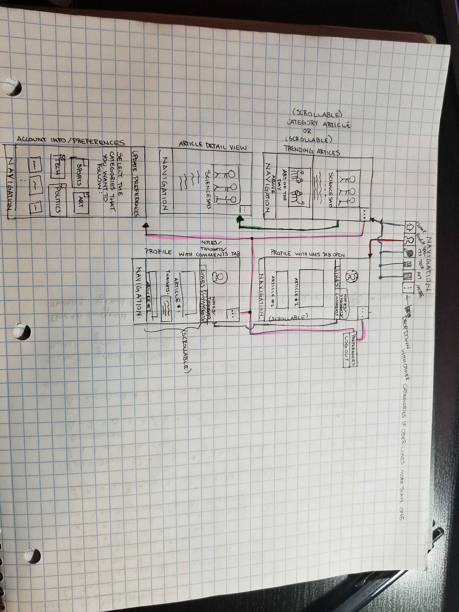

# InTheKnow

## Table of Contents
1. [Overview](#Overview)
1. [Product Spec](#Product-Spec)
1. [Wireframes](#Wireframes)
2. [Schema](#Schema)

## Overview
### Description
A personalized application that takes news to the next level

### App Evaluation
- **Category:** News / Social
- **Mobile:** Mobile first experience
- **Story:** Allows user to gain knowledge about what is going on in the world on a daily basis
- **Market:** Young Adults/College Students
- **Habit:** Users can search, read, like, and comment on articles throughout the day many times. Features like "Profiles" encourage users to like articles that intigue them so that they can reference them at a later time. Users can explore endless articles in any catefory whenever they want. Very habbit forming!
- **Scope:** Reading, liking and commenting on articles for their own records. Might extend to being able to view other profiles.

## Product Spec

### 1. User Stories (Required and Optional)

**Required Must-have Stories**

* Users will be able to register for a new account on the app and login
* Once a user creates a new account, they will be prompted to answer a few brief questions in order to determine their interests and therefore relevant news articles will be provided on their 'news feed.'
* The articles will be fetched using a particular News API.

**Optional Nice-to-have Stories**

* Separate tabs will be maintained at the bottom of the screen according to the user's interests. Each tab will refer to a particular category (ex: 'Sports', 'Politics', 'Entertainment', 'Tech', etc.).
* Users will be given the option to update their preferences, and therefore the appropriate news articles will be fetched and displayed on their news feed.

### 2. Screen Archetypes

* Login/Register Screen
   *  Users will have to create an account before they can access the app. If an account has already been made, then they simply log in with their credentials.
* Update Interests Screen
   *  Users will have the ability to update their interests so that relevant news articles will be provided on their 'news feed'.
* News Feed
   * This screen will serve as the user's 'timeline' where they will be able to conveniently see all relevant news articles.

### 3. Navigation

**Tab Navigation** (Tab to Screen)

* Home: Shows the most trending articles from each of a users chosen categories
* Profile: Where user can repost their favorite articles 
* Categories: The rest of the tabs will be determined by the categories that each user chooses when they sign up

**Flow Navigation** (Screen to Screen)

* From Login/Register Screen user will be taken to either:
   * Update Interests Screen: If this is their first time registering for an account
   * News Feed: If they are simply logging into their accounts

## Wireframes

### [BONUS] Digital Wireframes & Mockups

### [BONUS] Interactive Prototype

## Schema 
[This section will be completed in Unit 9]
### Models
[Add table of models]
### Networking
- [Add list of network requests by screen ]
- [Create basic snippets for each Parse network request]
- [OPTIONAL: List endpoints if using existing API such as Yelp]
